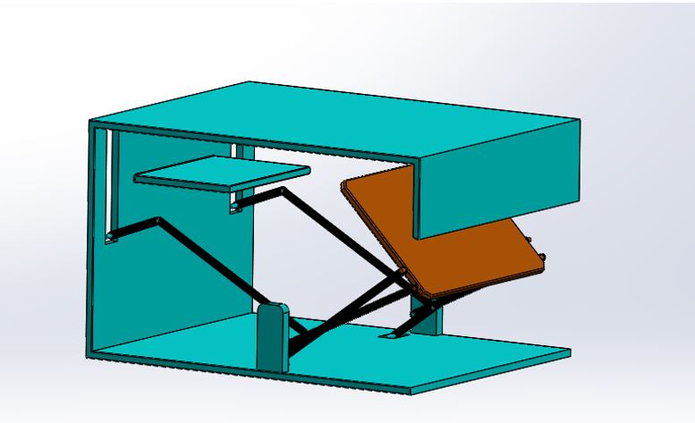
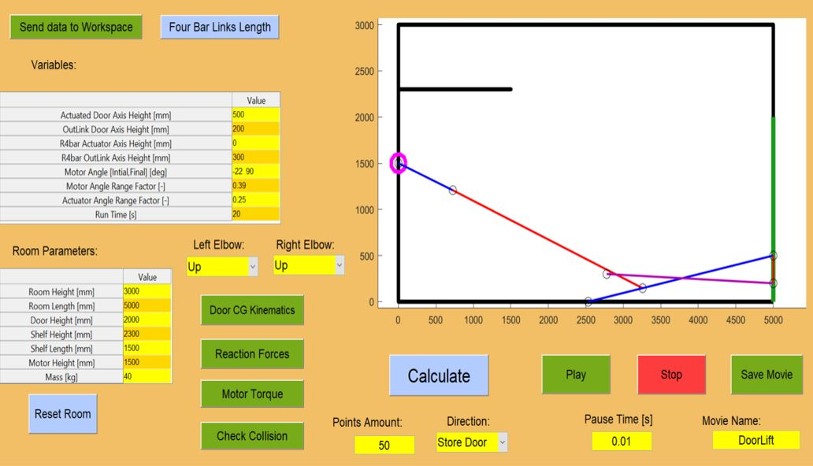
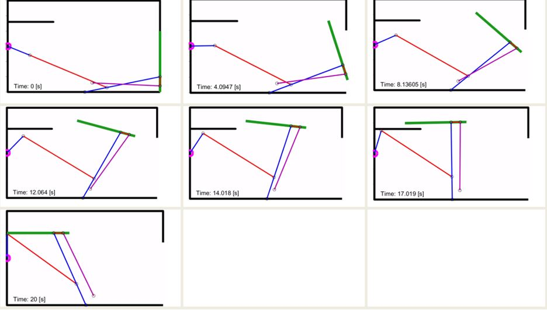

# GarageDoor_with4Bar
1) two linked four-bar mechanism to a lift a garage door
2) Kinematic and dynamic analysis
3) Torque minimization by intution built with a mega-GUI
4) Soldiworks model acutally built and working (no picture unfortunately)

